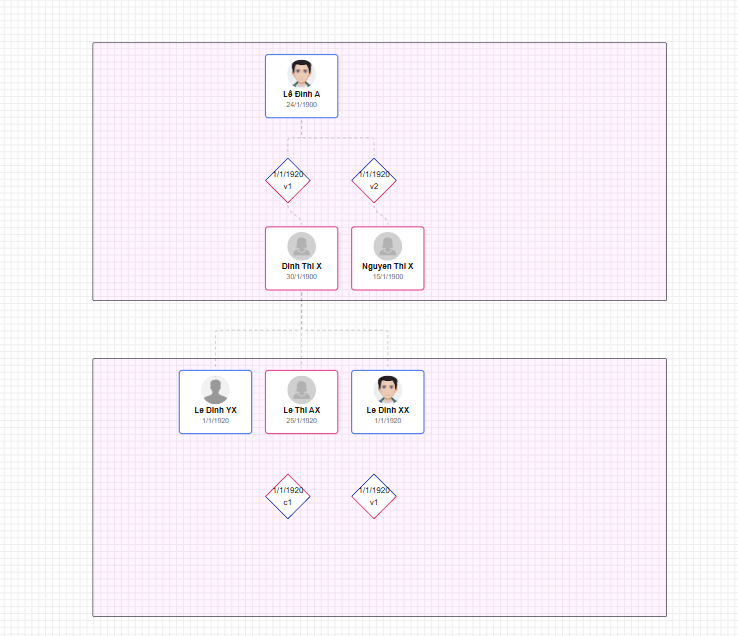

This project is build for save information about a family tree.

## Features

-   add person in family (see in "/backend/src/modules/person")
-   add relationship between person (see in "/backend/src/modules/spouse", and "/backend/src/modules/parent-child")

## Example UI showcase



Explanation of the UI:

-   Mỗi ô nền màu hồng to bao quanh là 1 thế hệ (generation box)
-   Trong mỗi thế hệ, có các ô viền (border) xanh nước biển là nam, viền hồng là nữ, các con cái trực hệ của của thế hệ trước ở đặt ở trên bên trong ô hình chữ nhật (generation box) của thế hệ đó, tiếp theo là hình thoi thể hiện quan hệ vợ chồng (spouse) của các con cái, và ở dưới trong generation box là các vợ/chồng của người đó.
-   một người có nhiều vợ/chồng, vì vậy 1 person có nhiều quan hệ spouse (spouse relationship)
-   1 spouse relationship có thể có nhiều con (children), vì vậy 1 spouse relationship có nhiều quan hệ parent-child (parent-child relationship)
-   Mỗi quan hệ parent-child (parent-child relationship) thể hiện 1 con của 1 spouse relationship, vì vậy 1 parent-child relationship chỉ liên kết với 1 spouse relationship và 1 person (con của spouse relationship đó)
-   các con của 1 spouse sẽ được nối từ các ô ở dưới trong generation box xuống các ô đầu của generation box của thế hệ con cái (generation phía dưới)

-   Ex:
    -   bắt đầù thế hệ G1 có 1 người là ông Lê Đình A (nam) viền xanh, ông có 2 vợ, sẽ được vẽ nối tới 2 hình thoi (spouse relationship) bên dưới, mỗi hình thoi sẽ nối tới 1 người vợ (hình chữ nhật viền hồng) là bà Đinh Thị X và bà Nguyễn Thị C. Tất cả G1 sẽ được bao quanh bởi 1 generation box (nền hồng to)
    -   tiếp theo thế hệ G2 là các con của ông Lê Đình A và các bà vợ, ví dụ con của ông A và bà X là anh Lê Văn Q (nam viền xanh), Lê Thị H (nữ viền hồng),... có thể có nhiều con hơn, nhừng người này được nối vào vào ô của bà Đinh Thị X thể hiện rằng họ là con của bà X và ông A. Tương tự với con của ông A và bà C là anh Lê Văn Z (nam viền xanh),... được nối vào bà Nguyễn Thị C. Tất cả G2 sẽ được bao quanh bởi 1 generation box (nền hồng to),
    -   thứ tự hiển thị trong 1 thế hệ, thứ tự con cái theo thứ tự năm sinh (từ lớn đến bé), (từ trái sang phải) sét trong cùng 1 cặp bố mẹ, thứ tự các vợ/chồng thì xếp theo thứ tự năm cưới ai cưới trước hiển thị bên trái, tiếp theo bên phải.
    -   tiếp tục như vậy các con cũng sẽ có vợ/chồng và con cái của họ sẽ được hiển thị ở thế hệ tiếp theo (generation box tiếp theo bên dưới)

ví dụ code frontend thể hiện các node ban đầu:
Dữ liệu cho code frontend bên dưới thể hiện các node ban đầu trong family tree như hình trên:

```tsx
const initialNodes = [
    { id: "gen1", type: "group", data: { label: "Gen 1" }, position: { x: 200, y: 0 }, style: { width: 1000, height: GenHeight, backgroundColor: "rgba(255, 0, 255, 0.05)" } },
    {
        id: "1",
        type: "person",
        position: { x: 300, y: OffsetY.child },
        data: {
            cccd: "1234567890",
            name: "Lê Đình A",
            birth: new Date("1900-01-24"),
            avatar: "https://www.cartoonize.net/wp-content/uploads/2024/05/avatar-maker-photo-to-cartoon.png",
            gender: Gender.MALE,
            isDead: false,
            address: "Hà Nội",
            desc: "Là người cha của gia tộc",
        },
        sourcePosition: Position.Right,
        parentId: "gen1",
    } as TPersionNode,
    {
        id: "R12",
        type: "relationship",
        position: { x: 300, y: OffsetY.relationship },
        data: { top: Gender.MALE, husbandOrder: 1, wifeOrder: 1, marriageDate: new Date("1920-01-01"), divorceDate: new Date("1920-01-01") },
        parentId: "gen1",
    } as TRelationshipNode,
    {
        id: "2",
        type: "person",
        position: { x: 300, y: OffsetY.spouse },
        data: {
            cccd: "1224567890",
            name: "Dinh Thi X",
            birth: new Date("1900-01-30"),
            avatar: "https://encrypted-tbn0.gstatic.com/images?q=tbn:ANd9GcQ3rzFZs0tioVeqNH0BKGWxnzfGNevCLpvoXN-vWtjvsjUl5gjNW6lXGyuD7AwJltJgoKk&usqp=CAU",
            gender: Gender.FEMALE,
            isDead: false,
            address: "Hà Nội",
            desc: "",
        },
        sourcePosition: Position.Left,
        parentId: "gen1",
    } as TPersionNode,
    {
        id: "R13",
        type: "relationship",
        position: { x: 450, y: OffsetY.relationship },
        data: { top: Gender.MALE, husbandOrder: 1, wifeOrder: 2, marriageDate: new Date("1920-01-01"), divorceDate: new Date("1920-01-01") },
        parentId: "gen1",
    } as TRelationshipNode,
    {
        id: "3",
        type: "person",
        position: { x: 450, y: OffsetY.spouse },
        data: {
            cccd: "4253475475",
            name: "Nguyen Thi X",
            birth: new Date("1900-01-15"),
            avatar: "https://encrypted-tbn0.gstatic.com/images?q=tbn:ANd9GcQ3rzFZs0tioVeqNH0BKGWxnzfGNevCLpvoXN-vWtjvsjUl5gjNW6lXGyuD7AwJltJgoKk&usqp=CAU",
            gender: Gender.FEMALE,
            isDead: false,
            address: "Hà Nội",
            desc: "",
        },
        sourcePosition: Position.Left,
        parentId: "gen1",
    } as TPersionNode,

    { id: "gen2", type: "group", data: { label: "Gen 2" }, position: { x: 200, y: 550 }, style: { width: 1000, height: GenHeight, backgroundColor: "rgba(255, 0, 255, 0.05)" } },
    {
        id: "4",
        type: "person",
        position: { x: 300, y: OffsetY.child },
        data: {
            cccd: "56757457765",
            name: "Le Thi AX",
            birth: new Date("1920-01-25"),
            avatar: "https://encrypted-tbn0.gstatic.com/images?q=tbn:ANd9GcQ3rzFZs0tioVeqNH0BKGWxnzfGNevCLpvoXN-vWtjvsjUl5gjNW6lXGyuD7AwJltJgoKk&usqp=CAU",
            gender: Gender.FEMALE,
            isDead: false,
            address: "Hà Nội",
            desc: "",
        },
        sourcePosition: Position.Right,
        parentId: "gen2",
    },
    {
        id: "5",
        type: "person",
        position: { x: 450, y: OffsetY.child },
        data: {
            cccd: "4564636456",
            name: "Le Dinh XX",
            birth: new Date("1920-01-01"),
            avatar: "https://www.cartoonize.net/wp-content/uploads/2024/05/avatar-maker-photo-to-cartoon.png",
            gender: Gender.MALE,
            isDead: false,
            address: "Hà Nội",
            desc: "",
        },
        sourcePosition: Position.Left,
        parentId: "gen2",
    },
    {
        id: "6",
        type: "person",
        position: { x: 150, y: OffsetY.child },
        data: {
            cccd: "3454566334",
            name: "Le Dinh YX",
            birth: new Date("1920-01-01"),
            avatar: "",
            gender: Gender.MALE,
            isDead: false,
            address: "Hà Nội",
            desc: "",
        },
        sourcePosition: Position.Left,
        parentId: "gen2",
    },
    {
        id: "R24",
        type: "relationship",
        position: { x: 300, y: OffsetY.relationship },
        data: { top: Gender.FEMALE, husbandOrder: 1, wifeOrder: 1, marriageDate: new Date("1920-01-01"), divorceDate: new Date("1920-01-01") },
        parentId: "gen2",
    } as TRelationshipNode,
    {
        id: "R25",
        type: "relationship",
        position: { x: 450, y: OffsetY.relationship },
        data: { top: Gender.MALE, husbandOrder: 1, wifeOrder: 1, marriageDate: new Date("1920-01-01"), divorceDate: new Date("1920-01-01") },
        parentId: "gen2",
    } as TRelationshipNode,
] as Node[];

const initialEdges = [
    { id: "1_R12", source: "1", target: "R12", sourceHandle: "sb", targetHandle: "tt", type: "smoothstep", animated: true },
    { id: "R12_2", source: "R12", target: "2", sourceHandle: "sb", targetHandle: "tt", animated: true },

    { id: "1_R13", source: "1", target: "R13", sourceHandle: "sb", targetHandle: "tt", type: "smoothstep", animated: true },
    { id: "R13_3", source: "R13", target: "3", sourceHandle: "sb", targetHandle: "tt", animated: true },

    { id: "2_4", source: "2", target: "4", sourceHandle: "sb", targetHandle: "tt", type: "smoothstep", animated: true },
    { id: "2_6", source: "2", target: "6", sourceHandle: "sb", targetHandle: "tt", type: "smoothstep", animated: true },
    { id: "2_5", source: "2", target: "5", sourceHandle: "sb", targetHandle: "tt", type: "smoothstep", animated: true },
];
```

Dùng '@xyflow/react' để thể hiện family tree này.

code frontend ở trong thư mục "/frontend".

backend ở trong thư mục "/backend".

check lại hệ thống hiện có và hoàn thiện các chức năng cần thiết để lưu trữ và truy xuất dữ liệu family tree qua API.
nếu cần chạy backend thì gói backend và db dùng trong docker-compose.yml, khởi tạo dữ liệu ban đầu trong db có thể xem trong thư mục "/backend/src/seeds".
